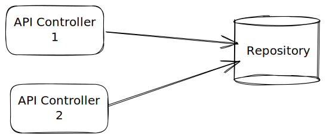

# Sequence

<p style="text-align: center;">
Music Recognition app using <a href="https://audd.io">Audd</a/>'s Music recognition API
</p>

<p align="center">
    <a href="https://github.com/stevenosse/sequence/actions">
        
    </a>
    <a href="https://codecov.io/gh/stevenosse/sequence" > 
         
    </a>
    <a href="http://hits.dwyl.com/stevenosse/sequence">
    </a>
    <a href="https://twitter.com/intent/follow?screen_name=nossesteve">
        
    </a>

</p>

# Content
* [🚧 Getting Started 🚧](#---getting-started---)
  + [App Demo:](#app-demo-)
  + [Running the app](#running-the-app)
    - [Step 1](#step-1)
    - [Step 2](#step-2)
    - [Step 3](#step-3)
* [Architecture and Folter Structure](#architecture-and-folter-structure)
  + [Data layer](#data-layer)
    - [Api Controllers](#api-controllers)
    - [Repositories](#repositories)
  + [Business logic layer](#business-logic-layer)
    - [Services](#services)
    - [Cubits/BLoCs](#cubits-blocs)
  + [Presentation layer](#presentation-layer)
* [Folder structure](#folder-structure)
* [Testing](#testing)
* [Tools](#tools)

## 🚧 Getting Started 🚧

🏗️ Construction is underway, there may be a lot of elements missing in this README

### App Demo:


### Running the app

Couple steps are required to run this app on your local machine.

First, get an API Token from Audd by following [this link](https://docs.audd.io/).

#### Step 1

An API Token is required to run the app. This API Token is retrieved from environment variables read throught dart define. You'll need to provide is as well as the api base url:

```shell
$ flutter run --dart-define apiBaseUrl=https://api.audd.io --dart-define AUDD_API_TOKEN=<YOUR_API_TOKEN>
```

#### Step 2

Install dependencies:

```shell
$ flutter pub get
```

#### Step 3

Run code generation:

```shell
$ flutter pub run build_runner build --delete-conflicting-outputs
```

## Architecture and Folter Structure

This project uses the BLoC Architecture. Learn more on [https://bloclibrary.dev](https://bloclibrary.dev/#/architecture)

### Data layer

This layer is responsible of manipulating data from one or more sources



#### Api Controllers

Are responsible for API calls. They all extend the `BaseApiController` class. Are not responsible for data processing.

```dart
class UserApiController extends BaseApiController {
  UserApiController({required super.dio});

  Future<Response<Json>> recognize({
    required Request request,
    CancelToken? cancelToken,
  }) async {
    try {
      final Response<Json> response = await dio.post('/endpoint', data: await request.toJson());

      return response;
    } on DioError catch (_) {
      rethrow;
    }
  }
}

```

#### Repositories

They can aggregate multiple data sources (eg. Multiple API Controllers). They all extend be `BaseRepository` class which contains the `runApiCall` method that has necessary logi cfor errors handling.

```dart
class TestRepository extends BaseRepository {
  final MyApiController _myApiController;
  final MySecondApiController _mySecondApiController;

  TestRepository({
    MyApiController? myApiController,
    MySecondApiController? mySecondApiController,
  }) : _myApiController = myApiController ?? locator<MyApiController>(),
      _mySecondApiController = mySecondApiController ?? locator<MySecondApiController>();

  Future<NetworkResponse<TestResponse, CustomHttpException>> test(MyRequest request) async {
    return runApiCall<TestResponse>(
      call: () async {
        final response = await _myApiController.test(request: request);

        return NetworkResponse.success(TestResponse.fromJson(response.data!));
      },
    );
  }
}
```

### Business logic layer

> The business logic layer's responsibility is to respond to input from the presentation layer with new states. This layer can depend on one or more repositories to retrieve data needed to build up the application state.

<small>From [https://bloclibrary.dev](https://bloclibrary.dev/#/architecture?id=business-logic-layer)</small>

This layer hosts our blocks, cubits and services.

> #### Services
>
> They are used to store any logic that's not related to a UI State

#### Cubits/BLoCs
>
> They are used to store any logic that can result to a UI State change

### Presentation layer

This layer is the one the user interacts with. It renders itself base on one or more BLoC/Cubit's state

### Folder structure

Here's how our folder structure look like:

```markdown
lib/
├── generated/
└── src/
├── core/
│ ├── i18n/
│ ├── routing/
│ ├── theme/
│ ├── app_initialiser.dart
│ ├── application.dart
│ └── environment.dart
├── datasource/
│ ├── http/
│ ├── models/
│ └── repositories/
│ └── base_repository.dart
├── features/
│ ├── music_recognition/
│ │ ├── enums/
│ │ ├── exceptions/
│ │ ├── logic/
│ │ ├── repositories/
│ │ ├── services/
│ │ └── ui/
│ └── music_details/
└── main.dart
```

## Testing

This repo uses couple of testing libs :

- [bloc_test](https://pub.dev/packages/bloc_test): A Dart package that makes testing blocs and cubits easy
- [mocktail](https://pub.dev/packages/mocktail): A Dart mock library which simplifies mocking with null safety support and no manual mocks or code generation.
- [http_mock_adapter](https://pub.dev/packages/http_mock_adapter): A simple to use mocking package for Dio intended to be used in tests. It provides various types and methods to declaratively mock request-response communication.

Usage examples are available in the `test` dir.

## Tools

- [fvm](fvm.app): used for flutter version management
- [flutter_gen](https://pub.dev/packages/flutter_gen): Used to generated assets
